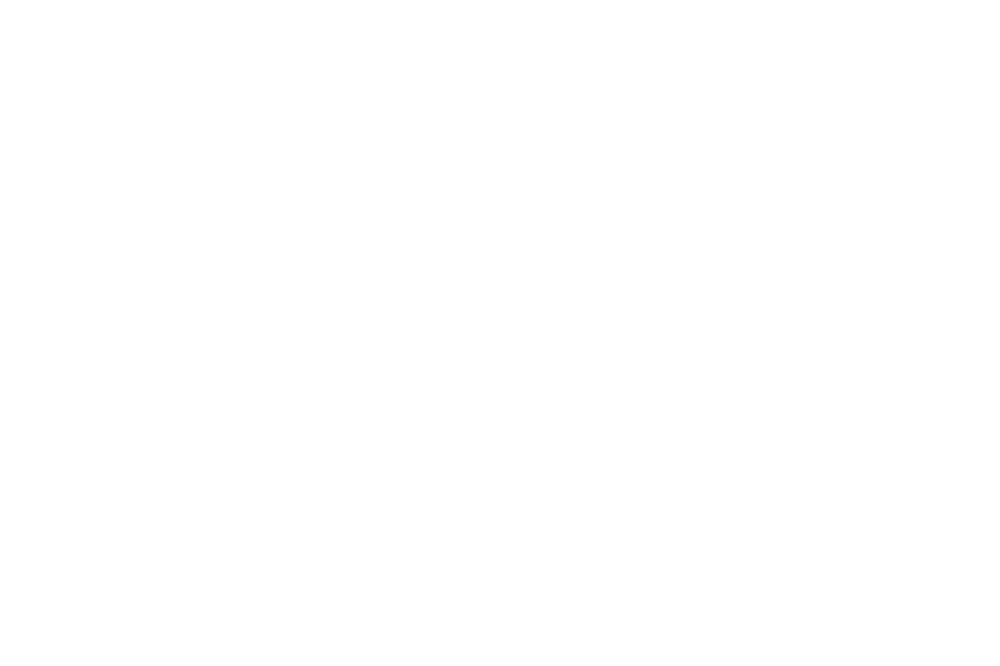
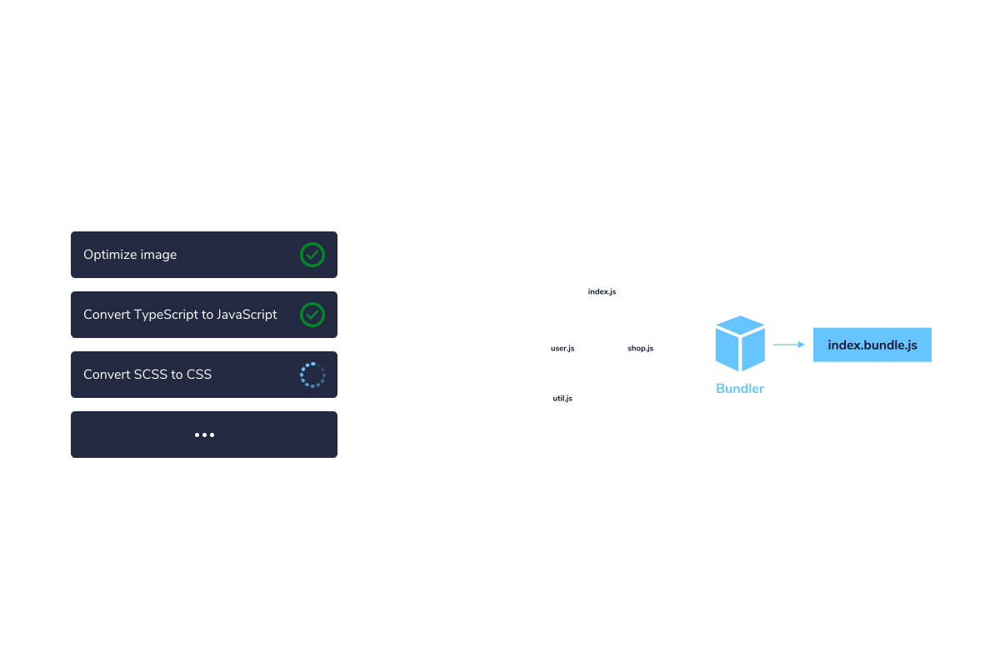
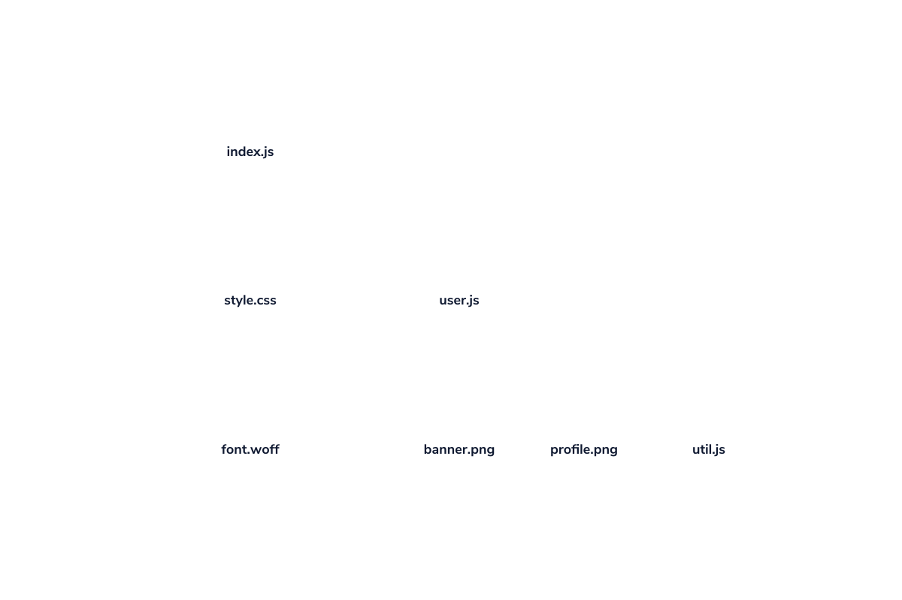
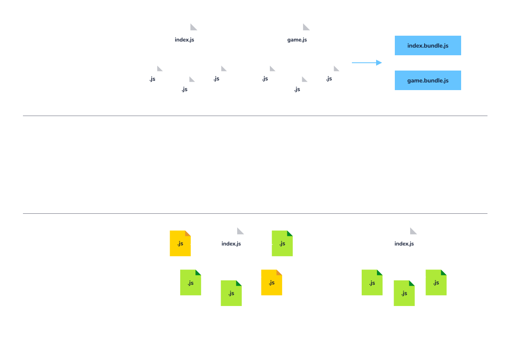
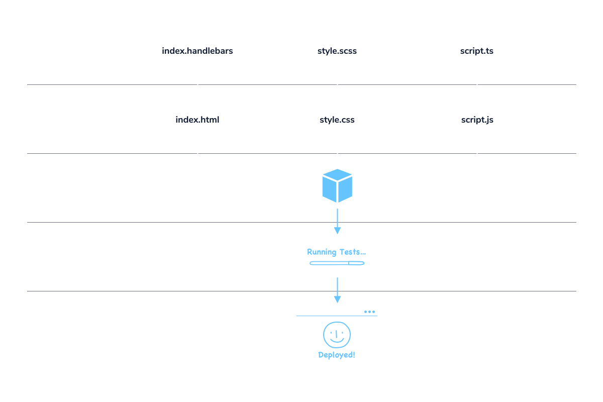

# The Web Development Ecosystem

Build tools are a part of a larger web development ecosystem, the set of tools used to create web applications and their interactions.

We can divide the process of producing a web app into three stages: development, testing, and deployment. Build tools can assist with all of them! In development, build tools can simplify the way different types of resources can be combined. The process of testing and deployment can be automated by task runners, and the content served in the deployment stage is often produced by bundlers.

## Types of Build Tools

- `Task runners` automate certain development processes, such as compiling code from SCSS to CSS or Typescript to JavaScript. Commonly used task runners for JavaScript are Grunt and gulp.js.

- `Bundlers` package JavaScript files and other assets such as stylesheets, images, and fonts into bundled files. Bundlers remove unused and duplicated code, improving download speed. Commonly used bundlers include Webpack, esbuild, Parcel, and Vite.

## Dependency Graphs

The connections between assets need to be mapped by the bundler to produce an output containing everything the app needs. This process uses a data structure called a dependency graph.

A dependency graph is a type of data structure formed by a directed graph representing the relationship between different files. When one file depends on another, a connection is added to the graph. Once all the connections are added, the bundler knows exactly what it must incorporate into the build.

Take a look at the representation of a dependency graph on the right. index.js depends on two files: style.css and user.js. style.css also has a dependency for a font file, font.woff. user.js depends on another JavaScript file, util.js, and two image assets, banner.png and profile.png.

## Improving Performance

A large and complex application can take a long time to download in the browser if not optimized. Build tools utilize processes such as code-splitting, minification, dead-code elimination, and tree-shaking to reduce the size of downloads.

Code-splitting is a technique that allows you to split your code into multiple files or chunks that can be loaded as needed.

Minification is a process that removes comments, whitespace, and other unneeded data from your code. References in the code can also be renamed so that the resulting bundle is smaller.

Dead-code elimination aims to remove any code not actually used by the finished application.

Tree-shaking is a type of dead-code elimination that searches included modules for files and functions that are not used.

Build tools use combinations of these strategies to help streamline your web applications!

## Review

## Additional

### What is Linting?

Learn how linters can help your code be free of errors and vulnerabilities!

Do you ever get tired of making all your curly braces line up? Wish your code could automatically find that missing semicolon on its own? Well, good news: there’s a tool for that!

A linter is a tool that scans source code for potential issues, including syntax errors, faulty code structures, stylistic inconsistencies, and security. Linters can automatically detect missing semicolons or future security breaches early on during the development cycle to reduce the number of errors that need to be resolved during testing. Some popular linters include ESLint for JavaScript, JSHint for JavaScript, and Stylelint for CSS.

Why Should You Lint?
Linters provides a number of automated checks that help streamline software development.

Technical Issues
Syntax Errors
Linters can automatically find and fix syntax errors before running your code, meaning fewer bugs to deal with during production.

Problematic Code Structures (i.e. “Code Smells”)
Linters can also flag potentially problematic code structures, or “code smells”. These are weak points in your application design, such as unnecessarily long methods and duplicated code, that could result in future bugs and impaired app performance.

Stylistic Code Conventions
Linters also push developers to adhere to a consistent set of stylistic code standards, improving code readability and maintainability. Sticking to a consistent coding style saves time by enabling developers to focus on the application’s architecture and core logic rather than code aesthetics.

Security
Some linters, such as ESLint, can detect potential security vulnerabilities in your code to help you ensure that the application is secure and well-protected.

Linters vs. Build Tools
Build tools and linters both go through and edit your source code, but they are separate categories of development tools. Linting occurs as you write your code, whereas build tools are applied when only when you want to preview or ship your code base. However, linting can be a part of the build process with some build tools, such as Webpack or Parcel.

Summary
Linters automatically detect errors, security vulnerabilities, and style inconsistencies in order to help streamline application development. Using a linter can reduce the amount of time spent testing and debugging. Try using a linter when you develop your next web application!
