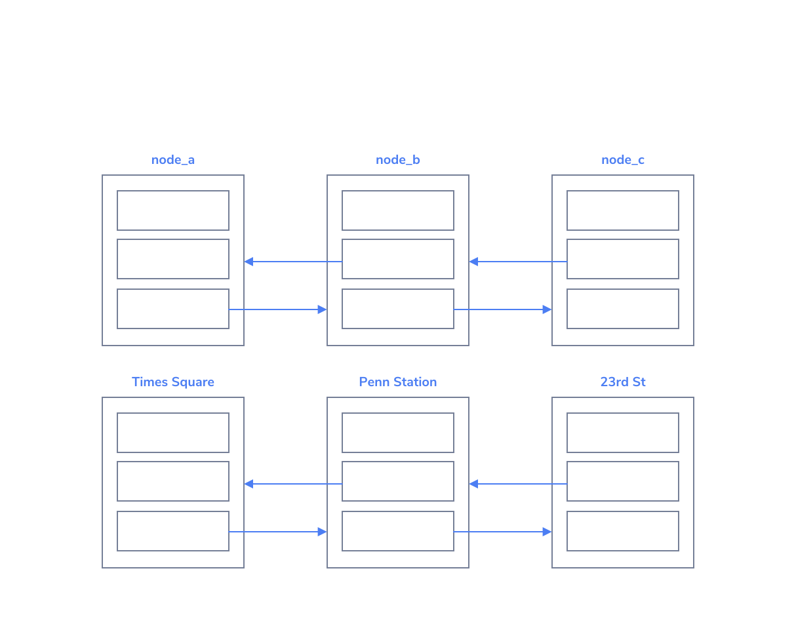
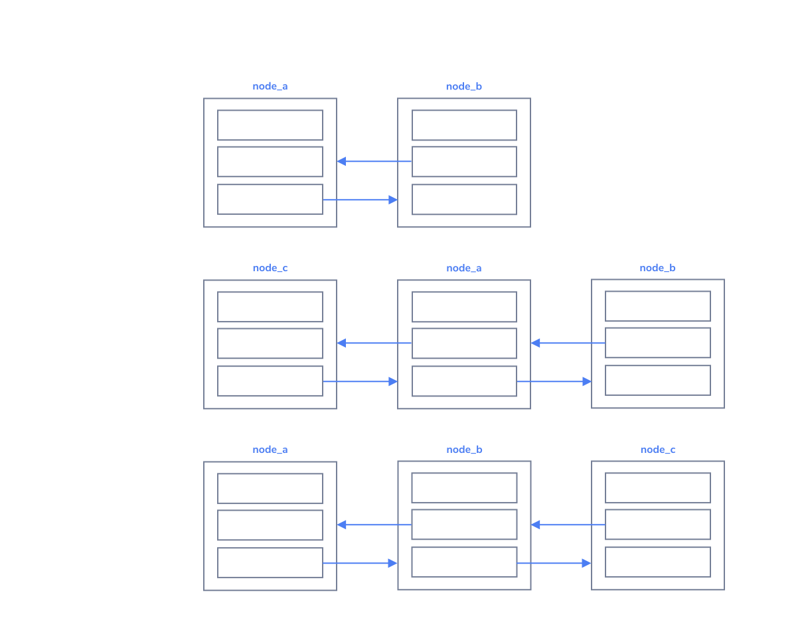
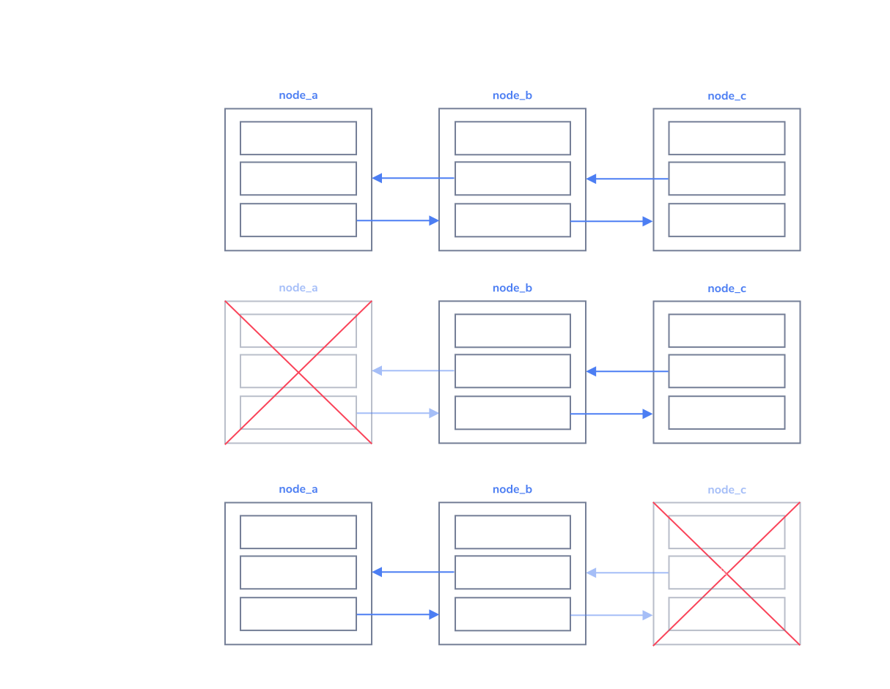
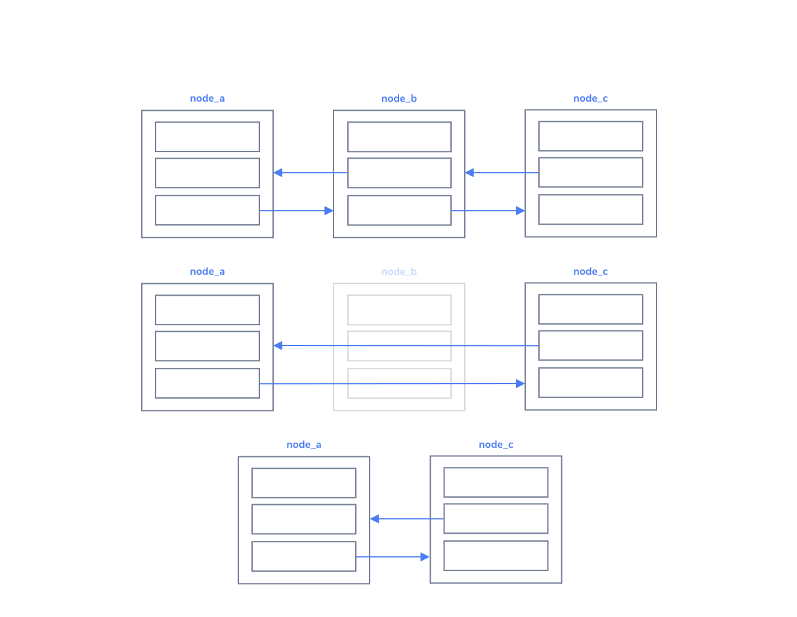

# Doubly Linked Lists

## Doubly Linked Lists Introduction

Like a singly linked list, a doubly linked list is comprised of a series of nodes. Each node contains data and two links (or pointers) to the next and previous nodes in the list. The head node is the node at the beginning of the list, and the tail node is the node at the end of the list. The head node’s previous pointer is set to null and the tail node’s next pointer is set to null.

Think of your daily commute on the subway as a real-world example of a doubly linked list. Your home is the head of the list, your place of work is the tail, and every stop in between is another node in the list. In the morning when you take the subway to get to work, you are traversing the list from the head to the tail, using the stop’s next pointer. While this can also be done using a singly linked list, a doubly linked list will also allow you to traverse back through the list easily, using the stop’s previous pointer. You will take the exact same route to get home, just in reverse.

Common operations on a doubly linked list may include:

- adding nodes to both ends of the list
- removing nodes from both ends of the list
- finding, and removing, a node from anywhere in the list
- traversing (or traveling through) the list

## Adding to the List

In a doubly linked list, adding to the list is a little complicated as we have to keep track of and set the node’s previous pointer as well as update the tail of the list if necessary.

## Adding to the Head

When adding to the head of the doubly linked list, we first need to check if there is a current head to the list. If there isn’t, then the list is empty, and we can simply make our new node both the head and tail of the list and set both pointers to null. If the list is not empty, then we will:

Set the current head’s previous pointer to our new head
Set the new head’s next pointer to the current head
Set the new head’s previous pointer to null

## Adding to the Tail

Similarly, there are two cases when adding a node to the tail of a doubly linked list. If the list is empty, then we make the new node the head and tail of the list and set the pointers to null. If the list is not empty, then we:

Set the current tail’s next pointer to the new tail
Set the new tail’s previous pointer to the current tail
Set the new tail’s next pointer to null

## Removing from the Head and Tail

Due to the extra pointer and tail property, removing the head from a doubly linked list is slightly more complicated than removing the head from a singly linked list. However, the previous pointer and tail property make it much simpler to remove the tail of the list, as we don’t have to traverse the entire list to be able to do it.

## Removing the Head

Removing the head involves updating the pointer at the beginning of the list. We will set the previous pointer of the new head (the element directly after the current head) to null, and update the head property of the list. If the head was also the tail, the tail removal process will occur as well.

## Removing the Tail

Similarly, removing the tail involves updating the pointer at the end of the list. We will set the next pointer of the new tail (the element directly before the tail) to null, and update the tail property of the list. If the tail was also the head, the head removal process will occur as well.

## Removing from the Middle of the List

It is also possible to remove a node from the middle of the list. Since that node is neither the head nor the tail of the list, there are two pointers that must be updated:

We must set the removed node’s preceding node’s next pointer to its following node
We must set the removed node’s following node’s previous pointer to its preceding node
There is no need to change the pointers of the removed node, as updating the pointers of its neighboring nodes will remove it from the list. If no nodes in the list are pointing to it, the node is orphaned.

## Doubly Linked Lists Review

Let’s take a minute to review what we’ve covered about doubly linked lists in this lesson. Doubly Linked Lists:

- Are comprised of nodes that contain links to the next and previous nodes
- Are bidirectional, meaning it can be traversed in both directions
- Have a pointer to a single head node, which serves as the first node in the list
- Have a pointer to a single tail node, which serves as the last node in the list
- Require the pointers at the head of the list to be updated after addition to or removal of the head
- Require the pointers at the tail of the list to be updated after addition to or removed of the tail
- Require the pointers of the surrounding nodes to be updated after removal from the middle of the list
Your browser history is another example of a doubly linked list. When you open your browser, the page that you land on is the head of your list. As you click on things and navigate to new pages, you are moving forward and adding to the tail of your list. If you ever want to go back to something you’ve already visited, you can use the “back” button to move backward through your list. Can you think of another computer use case for a doubly linked list?
