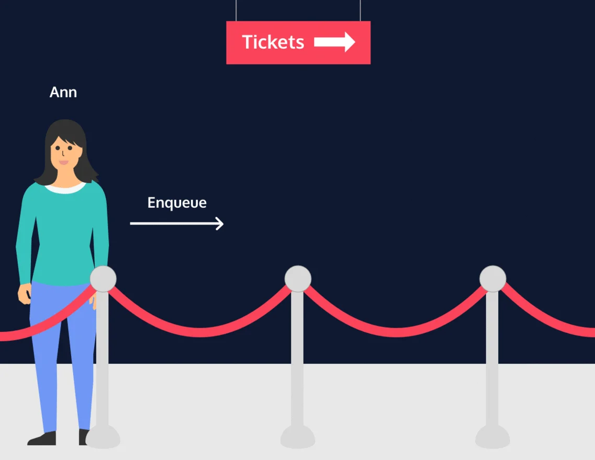
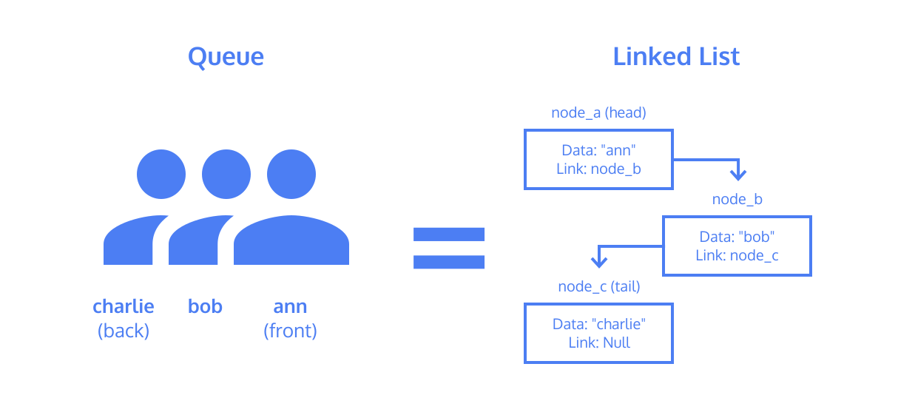

# Queues Introduction

A queue is a data structure which contains an ordered set of data.

Queues provide three methods for interaction:

`Enqueue` - adds data to the “back” or end of the queue
`Dequeue` - provides and removes data from the “front” or beginning of the queue
`Peek` - reveals data from the “front” of the queue without removing it

This data structure mimics a physical queue of objects like a line of people buying movie tickets. Each person has a name (the data). The first person to enqueue, or get into line, is both at the front and back of the line. As each new person enqueues, they become the new back of the line.

When the cashier serves someone, they begin at the front of the line (or people would get very mad!). Each person served is dequeued from the front of the line, they purchase a ticket and leave.

If they just want to know who is next in line, they can peek and get their name without removing them from the queue.

The first person in the queue is the first to be served. Queues are a First In, First Out or FIFO structure.

## Queues Implementation

Queues can be implemented using a linked list as the underlying data structure. The front of the queue is equivalent to the head node of a linked list and the back of the queue is equivalent to the tail node.

Since operations are only allowed affecting the front or back of the queue, any traversal or modification to other nodes within the linked list is disallowed. Since both ends of the queue must be accessible, a reference to both the head node and the tail node must be maintained.

One last constraint that may be placed on a queue is its length. If a queue has a limit on the amount of data that can be placed into it, it is considered a bounded queue.

Similar to stacks, attempting to enqueue data onto an already full queue will result in a queue overflow. If you attempt to dequeue data from an empty queue, it will result in a queue underflow.

## Queues Review

Let’s take a minute to review what we’ve covered about queues in this lesson.

Queues:

- Contain data nodes
- Support three main operat ions:
- Enqueue adds data to the back of the queue
- Dequeue removes and provides data from the front of the queue
- Peek provides data on the front of the queue
- Can be implemented using a linked list or array
- Bounded queues have a limited size.
- Enqueueing onto a full queue causes a queue overflow
- Queues process data First In, First Out (FIFO)
