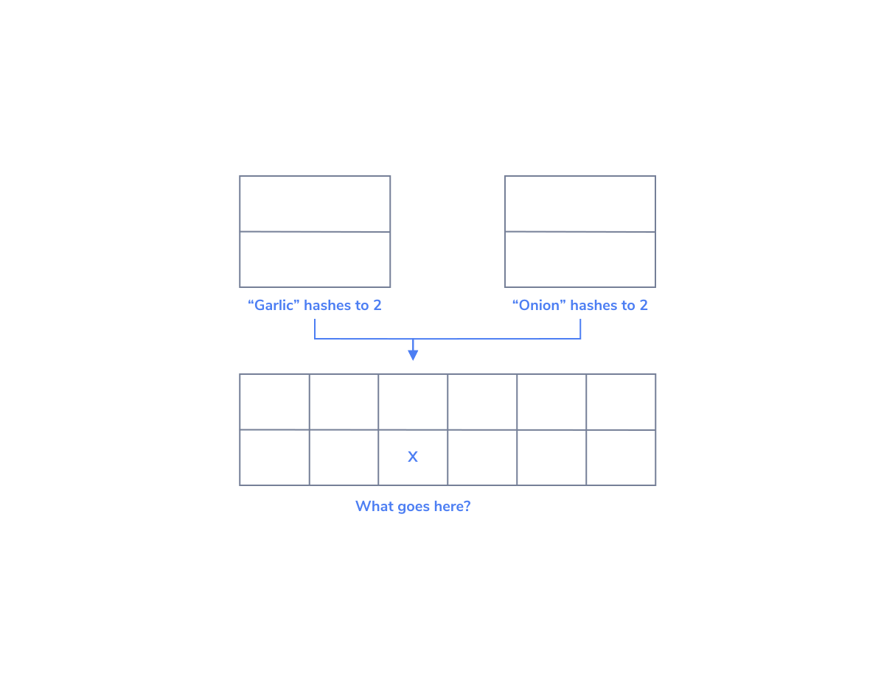
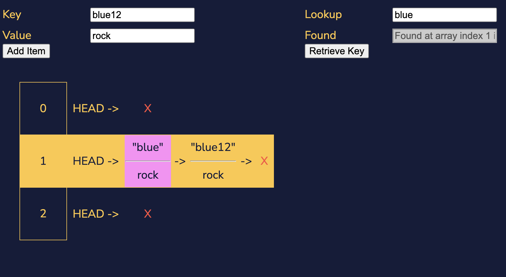
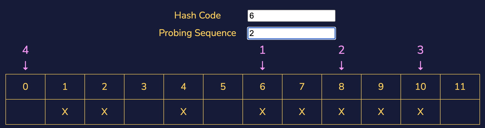
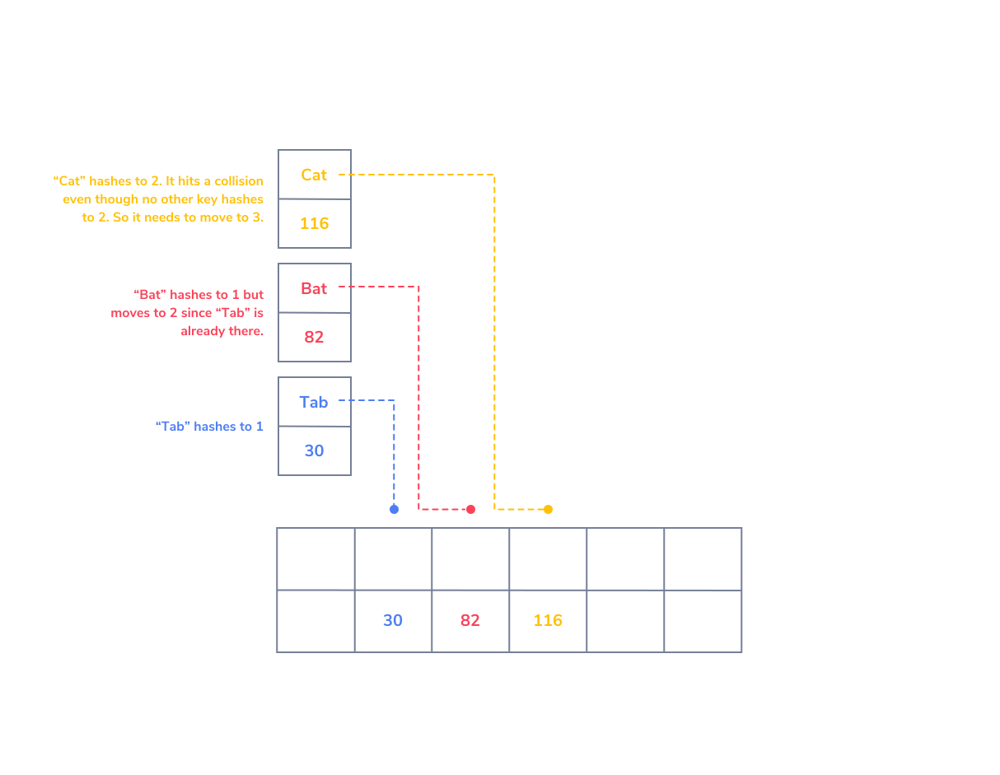

# Hash tables

## Tables

A data structure’s main utility is allowing for data to be represented in a way that resembles the way people will use that data. In some cases, the primary function of that data is that it will be sequenced through like a list and so we use a data structure that allows for easier iteration, like a linked list. In others, the usefulness comes from specifying interrelationships within the data.

In the case of tabular data there is a relationship between the elements of a row. Each column corresponds to a different feature of the row. Let’s consider the following table:

| State | State Flower
| ----- | ------- |
| Alabama | Camellia |
| Hawaii | Hibiscus|
|Mississippi | Magnolia|
|New York | Rose|
|West Virginia | Rhododendron|

Each State on the left corresponds to a specific State Flower given on the right. For instance, “New York” corresponds to “Rose”. This kind of table, with only two columns, represents a special relationship that mathematicians would call a “map”. This table maps states to state flowers, but many other relationships can be modeled with maps.

## Maps

Being a map means relating two pieces of information, but a map also has one further requirement. Let’s consider the following table:

| Musician | State of Birth |
| -- | - |
| Miles Davis| Illinois|
| John Coltrane| North Carolina|
| Duke Ellington| Ohio|
| Dizzy Gillespie| South Carolina|
| Thelonious Monk| North Carolina|

In the above table we map different jazz musicians to the state where they were born. When talking about a map we describe the inputs (jazz musicians, in this case) as the keys to the map. The output (here the state of origin) is said to be the value at a given key.

In order for a relationship to be a map, every key that is used can only be the key to a single value. In this example every musician can only have one state that they were born in, so it works. There doesn’t need to be a value for every possible key, there just can’t be more than one value for a given key. For instance, Miles Davis can’t be born in both Illinois and Kentucky.

If we looked at this relationship the other way, with states as the keys and jazz musicians born in a given state as values, this would not be a map. In the example above, if we look at “North Carolina” and try to get the jazz musician from that state, we’ll find it very difficult to do. Our relationship would give two different outputs: “John Coltrane” and “Thelonious Monk”.

We would still be able to describe that relationship with a table, but it wouldn’t be a map, and so we can’t save such a relationship using a hash map.

## Hash Map Methodology

In the case of a map between two things, we don’t really care about the exact sequence of the data. We only care that a given input, when fed into the map, gives the accurate output. Developing a data structure that performs this is tricky because computers care much more about values than relationships. A computer doesn’t really care to memorize the astrological signs of all of our friends, so we need to trick the computer into caring.

We perform this trick using a structure that our computer is already familiar with, an array. An array uses indices to keep track of values in memory, so we’ll need a way of turning each key in our map to an index in our array.


Imagine we want our computer to remember that our good friend Joan McNeil is a Libra. We take her name, and we turn that name into a number. Let’s say that the number we correspond with the name “Joan McNeil” is 17. We find the 17th index of the array we’re using to store our map and save the value (Libra) there.

How did we get 17, though? We use a special function that turns data like the string “Joan McNeil” into a number. This function is called a hashing function, or a hash function. Hashing functions are useful in many domains, but for our data structure the most important aspect is that a hashing function returns an array index as output.

## Hash Functions

A hash function takes a string (or some other type of data) as input and returns an array index as output. In order for it to return an array index, our hash map implementation needs to know the size of our array. If the array we are saving values into only has 4 slots, our hash map’s hashing method should not return an index bigger than that.

In order for our hash map implementation to guarantee that it returns an index that fits into the underlying array, the hash function will first compute a value using some scoring metric: this is the hash value, hash code, or just the hash. Our hash map implementation then takes that hash value moddulo (remainder) the size of the array. This guarantees that the value returned by the hash function can be used as an index into the array we’re using.

It is actually a defining feature of all hash functions that they greatly reduce any possible inputs (any string you can imagine) into a much smaller range of potential outputs (an integer smaller than the size of our array). For this reason, hash functions are also known as compression functions.

Much like an image that has been shrunk to a lower resolution, the output of a hash function contains less data than the input. Because of this, hashing is not a reversible process. With just a hash value it is impossible to know for sure the key that was plugged into the hashing function.

## How to Write a Hash Function

You might be thinking at this point that we’ve glossed over a very important aspect of a hash table here. We’ve mentioned that a hash function is necessary, and described some features of what a hash function does, but never really given an implementation of a hash function that does not feel like a toy example.

Part of this is because a hash function needs to be simple by design. Performing complex mathematical calculations that our hash table needs to compute every time it wants to assign or retrieve a value for a key will significantly damage a hash table’s performance for two things that it should be able to do quickly.

Hash functions also need to be able to take whatever types of data we want to use as a key. We only discussed strings, a very common use case, but it’s possible to use numbers as hash table keys as well.

A very common hash function for integers, for example, is to perform the modular operation on it to make sure it’s less than the size of the underlying array. If the integer is already small enough to be an index into the array, there’s nothing to be done.

Many hash functions implementations for strings take advantage of the fact that strings are represented internally as numerical data. Frequently a hash function will perform a shift of the data bitwise, which is computationally simple for a computer to do but also can predictably assign numbers to strings.

Writing a good hash function involves creating a function that takes an input (usually data you want to hash, like a key) and produces a fixed-size output (the hash value). The goal of a hash function is to distribute the data uniformly across the possible hash values to minimize collisions (when two different inputs produce the same hash value). Here's a general process for creating a hash function:

Choose a Hashing Algorithm:
Start by choosing a suitable hashing algorithm. Common algorithms include MD5, SHA-1, SHA-256, and more. However, these cryptographic hash functions might not be appropriate for all applications due to security concerns. For general-purpose hash functions, you might need to design your own or find a suitable non-cryptographic hash function.

Determine Input Size:
Understand the size of the input data you'll be hashing. Different hash functions might have limitations on the size of input they can handle. If you're hashing large data, you might need to break it down or preprocess it before hashing.

Choose a Hash Size:
Determine the desired size of your hash output. This will depend on your application and the expected number of items you'll be hashing. Common hash sizes are 32 bits, 64 bits, or 128 bits.

Map Input to Hash Output:
Design a mapping from your input data to the hash output. This process might involve operations like bitwise operations (AND, OR, XOR), arithmetic operations (addition, multiplication), and bit shifts. The idea is to transform the input data into the fixed-size hash output.

Aim for Uniform Distribution:
The key goal of a good hash function is to evenly distribute the input data across the possible hash values. This helps reduce collisions and ensures that similar inputs don't map to the same hash value.

Minimize Collisions:
Test your hash function with various types of input data to ensure that collisions are minimized. Collisions can lead to decreased performance in hash-based data structures.

Avoid Predictability:
A good hash function should produce seemingly random hash values even for similar input data. This helps prevent attackers from predicting or manipulating the hash values.

Test and Optimize:
Test your hash function with a variety of input data to ensure its effectiveness. If collisions are common or performance is suboptimal, consider refining your hash function or trying a different approach.

Consider Bit Spreading:
Bit spreading techniques, like using multiplication and bit masking, can help ensure that every bit of the input contributes to multiple bits in the hash value. This can lead to better distribution.

Documentation and Comments:
Provide clear documentation and comments for your hash function. Explain its purpose, design decisions, and any assumptions made. This will help others understand and use your hash function correctly.

Remember that writing a high-quality hash function can be complex, especially if you're aiming for a function that is both efficient and resistant to certain types of attacks. Depending on your application, you might also want to consider built-in hash functions provided by programming languages or libraries.

## Hash Maps

Now that we have all of the main ingredients for a hash map, let’s put them all together. First, we need some sort of associated data that we’re hoping to preserve. Second, we need an array of a fixed size to insert our data into. Lastly, we need a hash function that translates the keys of our array into indexes into the array. The storage location at the index given by a hash is called the hash bucket.

Let’s use the following example for our hash map:

|Key: Album Name Value: | Release Year|
|-|-|
|The Low End Theory | 1991|
|Midnight Marauders | 1993|
|Beats, Rhymes and Life | 1996|
|The Love Movement | 1998|

Our map here relates to several A Tribe Called Quest studio albums with the year they were produced in. We’ll need an array of at least size 4 to contain all of these elements. And a way to turn each album name into an index into that array.

For each album name, find that album’s hash by performing the following calculation:

```
hash_value = ((# of lowercase 'a's in album name) + (# of number of lowercase 'e's in album name))```

And then take that hash and calculate an array index by performing `hash_value mod 4`. Following these steps we get the following schema:
```

<div class="narrative-table-container">

| <font color=#52b1db>Album Name</font> | <font color=#52b1db>Hash</font> | <font color=#52b1db>Hash mod 4</font> | <font color=#52b1db>Release Year</font>
| --- | --- | --- | --- |
|The Low End Theory|2|2|1991|
|Midnight Marauders|3|3|1993|
|Beats, Rhymes and Life|5|1|1996|
|The Love Movement|4|0|1998|
</div>
<br>

```
First, the key is translated into the hash using our hashing function. Then, our hash map performs modulo arithmetic to turn the hash into an array index.
```


## Collisions

Remember hash functions are designed to compress data from a large number of possible keys to a much smaller range. Because of this compression, it’s likely that our hash function might produce the same hash for two different keys. This is known as a hash collision. There are several strategies for resolving hash collisions.

The first strategy we’re going to learn about is called separate chaining. The separate chaining strategy avoids collisions by updating the underlying data structure. Instead of an array of values that are mapped to by hashes, it could be an array of linked lists!


## Separate Chaining

A hash map with a linked list separate chaining strategy follows a similar flow to the hash maps that have been described so far. The user wants to assign a value to a key in the map. The hash map takes the key and transforms it into a hash code. The hash code is then converted into an index to an array using the modulus operation. If the value of the array at the hash function’s returned index is empty, a new linked list is created with the value as the first element of the linked list. If a linked list already exists at the address, append the value to the linked list given.

This is effective for hash functions that are particularly good at giving unique indices, so the linked lists never get very long. But in the worst-case scenario, where the hash function gives all keys the same index, lookup performance is only as good as it would be on a linked list. Hash maps are frequently employed because looking up a value (for a given key) is quick. Looking up a value in a linked list is much slower than a perfect, collision-free hash map of the same size. A hash map that uses separate chaining with linked lists but experiences frequent collisions loses one of its most essential features.


## Saving Keys

A hash collision resolution strategy like separate chaining involves assigning two keys with the same hash to different parts of the underlying data structure. How do we know which values relate back to which keys? If the linked list at the array index given by the hash has multiple elements, they would be indistinguishable to someone with just the key.

If we save both the key and the value, then we will be able to check against the saved key when we’re accessing data in a hash map. By saving the key with the value, we can avoid situations in which two keys have the same hash code where we might not be able to distinguish which value goes with a given key.

Now, when we go to read or write a value for a key we do the following: calculate the hash for the key, find the appropriate index for that hash, and begin iterating through our linked list. For each element, if the saved key is the same as our key, return the value. Otherwise, continue iterating through the list comparing the keys saved in that list with our key.



## Open Addressing: Linear Probing

Another popular hash collision strategy is called open addressing. In open addressing we stick to the array as our underlying data structure, but we continue looking for a new index to save our data if the first result of our hash function has a different key’s data.

A common open method of open addressing is called probing. Probing means continuing to find new array indices in a fixed sequence until an empty index is found.

Suppose we want to associate famous horses with their owners. We want our first key, “Bucephalus”, to store our first value, “Alexander the Great”. Our hash function returns an array index 3 and so we save “Alexander the Great”, along with our key “Bucephalus”, into the array at index 3.

After that, we want to store “Seabiscuit”s owner “Charles Howard”. Unfortunately “Seabiscuit” also has a hash value of 3. Our probing method adds one to the hash value and tells us to continue looking at index 4. Since index 4 is open we store “Charles Howard” into the array at index 4. Because “Seabiscuit” has a hash of 3 but “Charles Howard” is located at index 4, we must also save “Seabiscuit” into the array at that index.

When we attempt to look up “Seabiscuit” in our Horse Owner’s Hash Map, we first check the array at index 3. Upon noticing that our key (Seabiscuit) is different from the key sitting in index 3 (Bucephalus), we realize that this can’t be the value we were looking for at all. Only by continuing to the next index do we check the key and notice that at index 4 our key matches the key saved into the index 4 bucket. Realizing that index 4 has the key “Seabiscuit” means we can retrieve the information at that location, Seabiscuit’s owner’s name: Charles Howard.



## Other Open Addressing Techniques

There are more sophisticated ways to find the next address after a hash collision, although anything too calculation-intensive would negatively affect a hash table’s performance. Linear probing systems, for instance, could jump by five steps instead of one step.

In a quadratic probing open addressing system, we add increasingly large numbers to the hash code. At the first collision we just add 1, but if the hash collides there too we add 4 ,and the third time we add 9. Having a probe sequence change over time like this avoids clustering.

Clustering is what happens when a single hash collision causes additional hash collisions. Imagine a hash collision triggers a linear probing sequence to assigns a value to the next hash bucket over. Any key that would hash to this “next bucket” will now collide with a key that, in a sense, doesn’t belong to that bucket anyway.

As a result the new key needs to be assigned to the next, next bucket over. This propagates the problem because now there are two hash buckets taken up by key-value pairs that were assigned as a result of a hash collision, displacing further pairs of information we might want to save to the table.



## Terms understanding

The term "`hash table`" refers to the general concept of using a hash function to map keys to indices for efficient data storage and retrieval. Certainly! Let's provide a clear distinction between the collision resolution methods and specific implementations of hash tables:

### Hash Table

A **hash table** is a fundamental data structure that uses a **hash function** to map keys to indices within an array. This enables efficient storage and retrieval of data. A hash table stores key-value pairs, and the hash function is responsible for converting keys into indices where values are stored. Hash tables are versatile and can be implemented using different strategies to handle collisions.

### Collision Resolution Methods

Collisions occur when multiple keys produce the same hash value, causing a clash in the hash table. Collision resolution methods are techniques used to manage and resolve these clashes effectively. There are two main collision resolution methods: **separate chaining** and **open addressing**.

### Separate Chaining

In **separate chaining**, each hash table index contains a container (like a linked list) that holds multiple key-value pairs with the same hash value. When a collision occurs, new entries are appended to the container at the corresponding index. This method ensures that keys with the same hash value can coexist in the same hash table slot.

### Open Addressing

**Open addressing** is an alternative collision resolution strategy. In this approach, if a collision happens, the algorithm searches for the next available empty slot within the hash table to place the conflicting key-value pair. There are various techniques under open addressing, such as **linear probing** (placing the entry in the next available slot), **quadratic probing** (placing the entry at positions with quadratic intervals), and more.

## Specific Implementations

### Hash Map

A **hash map** is a specific implementation of a hash table that employs one of the collision resolution methods (either separate chaining or open addressing) to handle clashes. It uses a hash function to map keys to indices and utilizes arrays or similar data structures to store values. Hash maps provide efficient insertion, retrieval, and deletion of key-value pairs.

### Separate Chaining Hash Map

A **separate chaining hash map** is a hash map implementation that specifically uses the separate chaining collision resolution method. It stores linked lists or other structures within the hash table's slots to manage collisions, allowing multiple values with the same hash to coexist in the same index.

### Open Addressing Hash Map

An **open addressing hash map** is a hash map implementation that employs open addressing as its collision resolution technique. When collisions occur, it searches for alternative slots within the hash table to store the conflicting key-value pairs.

In summary, while **hash table** is a broad concept of mapping keys to indices using a hash function, **hash map** refers to a specific implementation of a hash table that employs either separate chaining or open addressing to handle collisions. **Separate chaining** and **open addressing** are collision resolution methods used within hash map implementations to effectively manage clashes and ensure efficient data retrieval.
