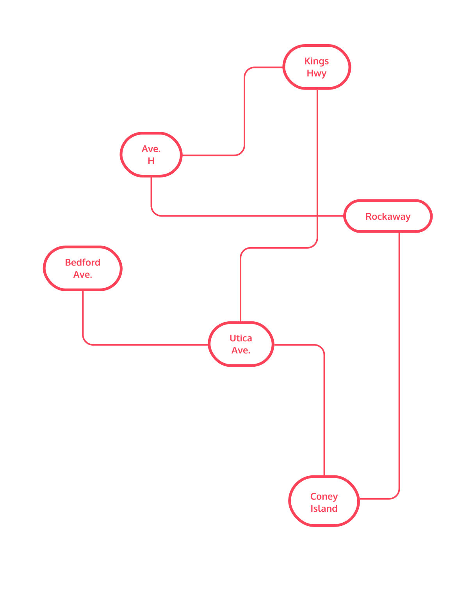
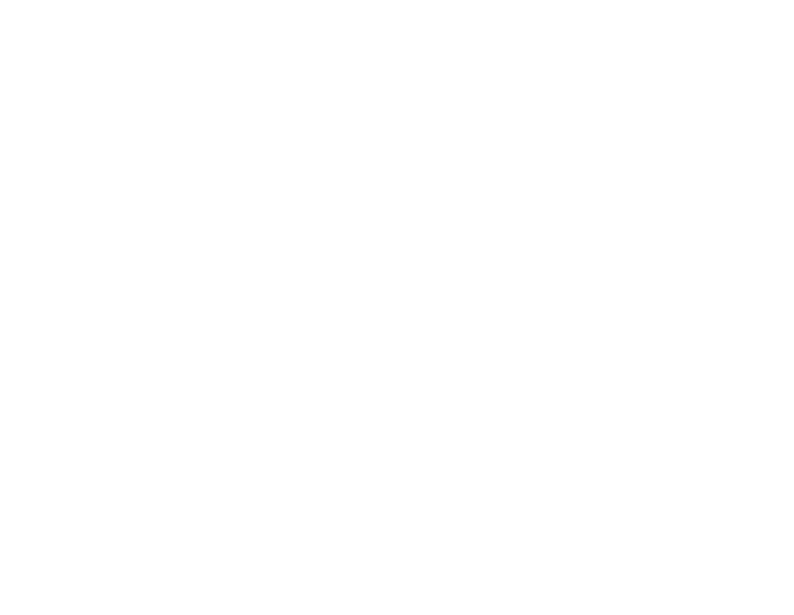
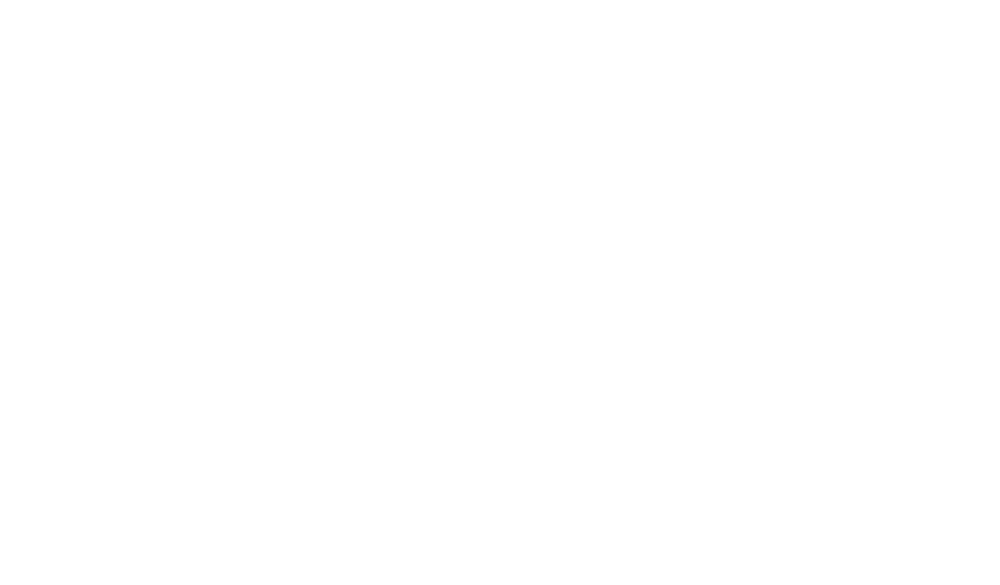
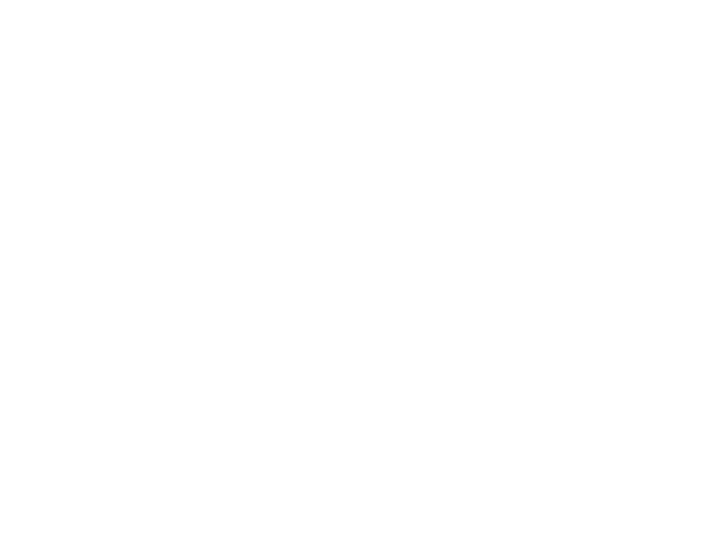

# Introduction to Graphs

Graphs are the perfect data structure for modeling networks, which make them an indispensable piece of your data structure toolkit. They’re composed of nodes, or vertices, which hold data, and edges, which are a connection between two vertices. A single node is a vertex.

Consider a map of the area where you live. As a graph, we could model bus stops as vertices, with bus routes between stops functioning as the edges.

What about the internet? Web pages can be vertices, and the hyperlinks which connect them are edges.

Real-world relationships modeled as graphs are numerous, making them an essential concept to master.

## To Connect, or Not to Connect?

Graphs have varying degrees of connection. The higher the ratio of edges to vertices, the more connected the graph.

This graph represents a social network; people are vertices and edges are friendships. Ted is adjacent to Patty, Ron, and Alice because an edge directly connects them.

We use a single line for an edge, but these friendships are bi-directional. Patty is friends with Ron and Ron is friends with Patty.

A path is vertices which are connected by any number of intermediate edges. The paths from Alice to Patty could go Alice to Ted to Patty or, Alice to Ted to Ron to Patty.

No path exists between Sally and Ted. When no path exists between two vertices, a graph is disconnected.

## You're Going to Carry that Weight

We’re building a graph of favorite neighborhood destinations (vertices) and routes (edges), but not all edges are equal. It takes longer to travel between Gym and Museum than it does to travel between Museum and Bakery.

This is a weighted graph, where edges have a number or cost associated with traveling between the vertices. When tallying the cost of a path, we add up the total cost of the edges used.

These costs are essential to algorithms that find the shortest distance between two vertices.

Gym and Library are adjacent, there’s one edge between them, but there’s less total cost to travel from Gym to Bakery to Library (10 vs. 9).

In a weighted graph, the shortest path is not always the least expensive.

## Directed Graphs

Imagine you’re a superhero escaping a villain’s lair. As you move from perilous room to perilous room, the doors close immediately behind you, barring any return.

For this dramatic example, we need a directed graph, where edges restrict the direction of movement between vertices.

We can move from spikes to lasers, but not from lasers to spikes. This differs from earlier examples when every edge was bi-directional.

Note the path spikes to lasers to piranhas to spikes. This path is a cycle, because it ends on the vertex where it began: spikes.

## Representing Graphs

We typically represent the vertex-edge relationship of a graph in two ways: an adjacency list or an adjacency matrix.

An adjacency matrix is a table. Across the top, every vertex in the graph appears as a column. Down the side, every vertex appears again as a row. Edges can be bi-directional, so each vertex is listed twice.

To find an edge between B and P, we would look for the B row and then trace across to the P column. The contents of this cell represent a possible edge.

Our diagram uses 1 to mark an edge, 0 for the absence of an edge. In a weighted graph, the cell contains the cost of that edge.

In an adjacency list, each vertex contains a list of the vertices where an edge exists. To find an edge, one looks through the list for the desired vertex.

## Reviewing Key Terms

Graphs are an essential data structure in computer science for modeling networks. Let’s review some key terms:

vertex: A node in a graph.
edge: A connection between two vertices.
adjacent: When an edge exists between vertices.
path: A sequence of one or more edges between vertices.
disconnected: Graph where at least two vertices have no path connecting them.
weighted: Graph where edges have an associated cost.
directed: Graph where travel between vertices can be restricted to a single direction.
cycle: A path which begins and ends at the same vertex.
adjacency matrix: Graph representation where vertices are both the rows and the columns. Each cell represents a possible edge.
adjacency list: Graph representation where each vertex has a list of all the vertices it shares an edge with.
