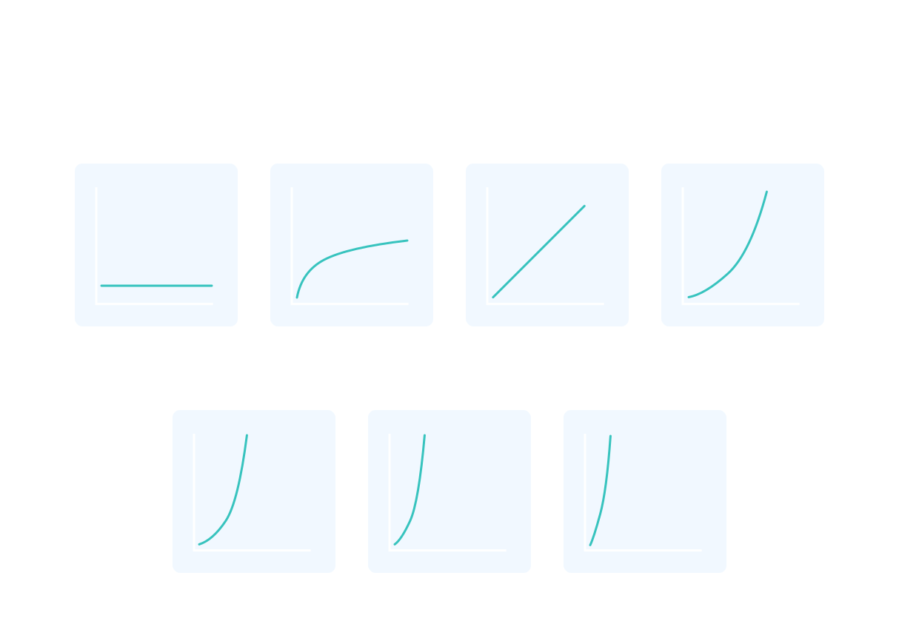

# Asymptotic Notation: Key to Efficient Programming

In the world of programming, efficiency is paramount. As we scale our programs to handle massive datasets and diverse computing environments, it's crucial to assess and compare their performance. This is where asymptotic notation steps in.

Rather than relying on absolute time measurements, which can vary based on hardware and programming languages, asymptotic notation provides a universal way to gauge a program's efficiency. It achieves this by examining how the number of instructions a computer performs scales with the input size, denoted as 'N'. For instance, when finding the maximum element in a collection, the number of steps required is proportional to 'N', regardless of language or hardware.

Asymptotic notation encompasses various forms tailored to specific concerns. Some highlight best-case scenarios, while others focus on worst-case scenarios, setting an upper limit on runtime. By leveraging asymptotic notation, programmers communicate that while things might get slow, they won't get any worse. It's the key to making informed decisions for efficient coding.

[Asymptotic Notation](https://www.youtube.com/watch?v=ZPLaE0HOR3M&ab_channel=Codecademy)

## Asymptotic notation is a mathematical notation used in computer science and mathematics to describe the limiting behavior of a function as its input approaches infinity. It's a way to analyze the performance of algorithms and functions, particularly in terms of their efficiency and scalability

The three most commonly used asymptotic notations are:

1. **Big O Notation (O)**: This notation describes the upper bound of an algorithm's running time. It provides an upper limit on the number of basic operations an algorithm performs in the worst-case scenario. For example, if an algorithm is described as O(n), it means that its running time grows linearly with the size of the input (n). Big O notation is used to analyze the worst-case performance of algorithms.

2. **Omega Notation (Ω)**: Omega notation describes the lower bound of an algorithm's running time. It provides a lower limit on the number of basic operations an algorithm performs in the best-case scenario. If an algorithm is described as Ω(n), it means that its running time has a lower bound that grows linearly with the size of the input. Omega notation is used to analyze the best-case performance of algorithms.

[1.Big O, 2. Omega](https://www.youtube.com/watch?v=EkDbukKyipU)

3. **[Theta Notation]((https://www.youtube.com/watch?v=LkjqqGg0VN0)) (Θ)**: Theta notation provides both an upper and lower bound on an algorithm's running time, indicating a tight bound on its performance. If an algorithm is described as Θ(n), it means that its running time grows linearly with the size of the input, and this growth is both the best and worst case. Theta notation is used when the best and worst-case scenarios have the same growth rate.

These notations are valuable for comparing and contrasting algorithms and for predicting how algorithms will perform as the input size increases. They help programmers and computer scientists make informed decisions about algorithm selection and design, particularly in scenarios where efficiency and scalability are critical, such as in large-scale data processing or real-time systems.

## The different common runtimes from fastest to slowest are: Θ(1), Θ(log N), Θ(N), Θ(N log N), Θ(N2), Θ(2N), Θ(N!)

1. **Θ(1)**: Constant time complexity. The algorithm's running time is constant and does not depend on the input size. This is the fastest possible runtime.

2. **Θ(log N)**: Logarithmic time complexity. The running time grows logarithmically with the input size. Algorithms with log N complexity are notably efficient for large datasets.

3. **Θ(N)**: Linear time complexity. The running time grows linearly with the input size. It means that as the input size increases, the running time increases proportionally.

4. **Θ(N log N)**: Linearithmic time complexity. This complexity is common in efficient sorting algorithms like Merge Sort and Quick Sort. It's faster than quadratic time but slower than linear and logarithmic time.

5. **Θ(N^2)**: Quadratic time complexity. The running time grows with the square of the input size. This is slower than linear and linearithmic time complexities and can be inefficient for large datasets.

6. **Θ(2^N)**: Exponential time complexity. The running time grows exponentially with the input size. Algorithms with exponential complexity can become extremely slow for moderate to large inputs.

7. **Θ(N!)**: Factorial time complexity. The running time grows with the factorial of the input size. This is the slowest common runtime and becomes impractical for all but very small inputs.

These notations are valuable for understanding how algorithms behave as the input size increases and for selecting algorithms that match the performance requirements of specific applications. Faster runtimes are generally preferred, especially for large-scale data processing and real-time systems, where efficiency is critical.

## Benefits of analyzing A.N

When finding the runtime of a program with multiple steps, you can divide the program into different sections and add the runtimes of the various sections. You can then take the slowest runtime and use that runtime to describe the entire program.
When analyzing the runtime of a program, we care about which part of the program is the slowest. explain practical understanding of the result of runtime analys and what we do with this

Analyzing the runtime of a program is a crucial aspect of algorithm design and optimization. When you have a program with multiple steps, understanding the runtime of each section and identifying the slowest part provides insights into its overall efficiency. Here's a practical understanding of the results of runtime analysis and what you can do with this information:

1. **Identify Performance Bottlenecks:** Runtime analysis helps you pinpoint which parts of your program are consuming the most time and resources. It allows you to identify performance bottlenecks or "hotspots" in your code.

2. **Optimization Focus:** Once you've identified the slowest part of your program, you can focus your optimization efforts on that specific section. This might involve rewriting algorithms, improving data structures, or using more efficient libraries or functions.

3. **Algorithm Selection:** If your analysis reveals that a particular algorithm or approach is causing performance issues, you can consider alternative algorithms that have better time complexity for the problem at hand.

4. **Scalability Assessment:** Understanding the runtime behavior of your program allows you to assess how it will perform as input sizes increase. You can predict whether your program will scale efficiently or if it will slow down significantly as data grows.

5. **Resource Allocation:** In resource-constrained environments, such as embedded systems or mobile devices, knowing the runtime characteristics of your code is vital for efficient resource allocation. You can ensure that your program doesn't consume excessive memory or CPU cycles.

6. **User Experience:** For applications with user interfaces, knowing which parts of your code are slowing down the user experience is crucial. Slow response times can lead to user frustration and abandonment of your application.

7. **Real-time Systems:** In real-time systems, where timely responses are critical (e.g., autonomous vehicles, medical devices), understanding the worst-case runtime is essential to ensure safety and reliability.

8. **Code Refactoring:** Based on your analysis, you may decide to refactor or restructure your code to improve performance. This might involve breaking down monolithic functions, optimizing loops, or adopting more efficient algorithms.

9. **Testing and Validation:** Runtime analysis can be used as a benchmark for testing and validation. You can set performance targets and use automated testing to ensure that your code meets those targets.

10. **Documentation and Communication:** Communicating the runtime characteristics of your program is important when working in teams or collaborating with others. It helps set expectations and allows others to make informed decisions about integrating or interacting with your code.

In summary, runtime analysis is a powerful tool for understanding and improving the performance of your programs. It guides optimization efforts, helps you make informed decisions about algorithm selection, and ensures that your software meets performance requirements, ultimately leading to more efficient and reliable applications.

