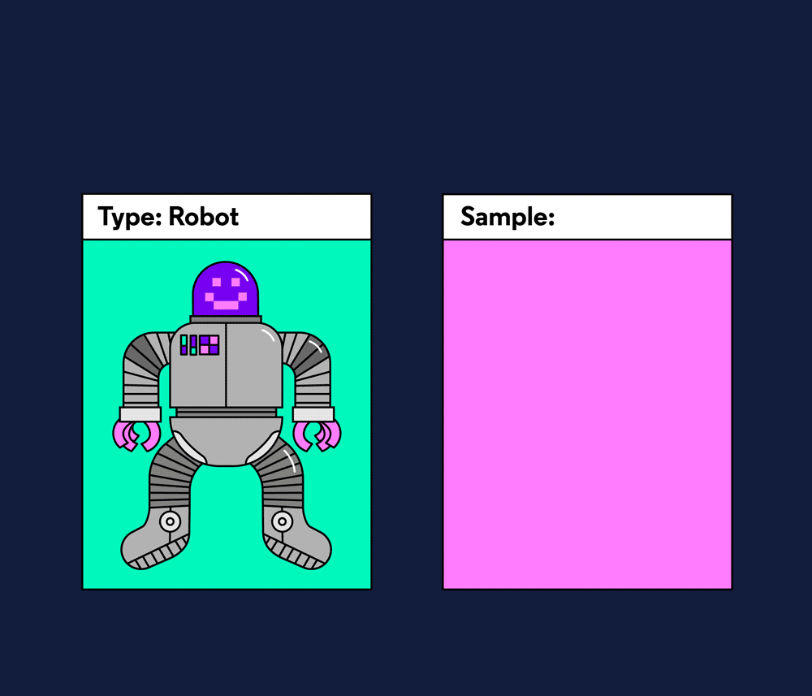

# ADVANCED OBJECT TYPES

## Introduction

One of the challenges of writing TypeScript is knowing how to apply types in every situation we’ll encounter within our code. Take a look at this example:

```ts
class Robot {
  identify(id: number) {
    console.log(`beep! I'm ${id}`);
  }
}
```

Here, we’ve created a class named Robot. How could we apply the type Robot? Also, some robots may have more functionality than others, or have variable property names. How might we apply types in these situations?

This lesson is about how we can deal with a variety of situations to make sure that our code is typed, no matter what our program does or how it’s structured. Types should always help make our code safer, without imposing restrictions on how we write and organize our code.

In this lesson, we’ll dive deep into how to use types with object-oriented programming patterns, how to use types together to create combined types, and so much more!


## Interfaces and Types

In TypeScript, we can define types in a variety of ways to fit our code. We’ve used the type keyword to define types, however, there’s another way to define types with the interface keyword.

Here’s a type that you’ve seen before:

```ts
type Mail = {
  postagePrice: number;
  address: string;
}

const catalog: Mail = ...
```

And here is an identical type that utilizes interface:

```ts
interface Mail {
  postagePrice: number;
  address: string;
}

const catalog: Mail = ...
```

In this example, we used both a type and an interface to create a typed object named Mail. The syntaxes for type and interface are slightly different, since interface does not require an equals sign (=) before the typed object. Functionally, the two Mail types in the example are identical: both will enforce the typed object at compile time when typing a variable.

The biggest difference between interface and type is that interface can only be used to type objects, while type can be used to type objects, primitives, and more. As it turns out, type is more versatile and functional than interface. So why would we use interface?

Sometimes, we don’t want a type that can do everything. We’d like our types to be constrained so we’re more likely to write consistent code. Since interface may only type objects, it’s a perfect match for writing object-oriented programs because these programs need many typed objects. So, let’s get started writing types with interface.

## Interfaces and Types

In TypeScript, we can define types in a variety of ways to fit our code. We’ve used the type keyword to define types, however, there’s another way to define types with the interface keyword.

Here’s a type that you’ve seen before:

```ts
type Mail = {
  postagePrice: number;
  address: string;
}

const catalog: Mail = ...
```

And here is an identical type that utilizes interface:

```ts
interface Mail {
  postagePrice: number;
  address: string;
}

const catalog: Mail = ...
```

In this example, we used both a type and an interface to create a typed object named Mail. The syntaxes for type and interface are slightly different, since interface does not require an equals sign (=) before the typed object. Functionally, the two Mail types in the example are identical: both will enforce the typed object at compile time when typing a variable.

The biggest difference between interface and type is that interface can only be used to type objects, while type can be used to type objects, primitives, and more. As it turns out, type is more versatile and functional than interface. So why would we use interface?

Sometimes, we don’t want a type that can do everything. We’d like our types to be constrained so we’re more likely to write consistent code. Since interface may only type objects, it’s a perfect match for writing object-oriented programs because these programs need many typed objects. So, let’s get started writing types with interface.

## Interfaces and Classes

The interface keyword in TypeScript is especially good for adding types to a class. Since interface is constrained to typed objects and using class is a way to program with objects, interface and class are a great match.

TypeScript gives us the ability to apply a type to an object/class with the implements keyword, like this:

```ts
interface Robot {
  identify: (id: number) => void;
}

class OneSeries implements Robot {
  identify(id: number) {
    console.log(`beep! I'm ${id.toFixed(2)}.`);
  }

  answerQuestion() {
    console.log('42!');
  }
}
```

In the example, there’s an interface named Robot and a class named OneSeries. The implements keyword is then used to apply the type Robot to OneSeries.

Notice that Robot has an .identify() method. Since Robot is applied to OneSeries, OneSeries must include a method named .identify() that matches the Robot interface. Additionally, OneSeries can have methods and properties of its own, like the .answerQuestion() method.

implements and interface allow us to create types that match a variety of class patterns, which makes interface a good tool for use on object-oriented programs

## Deep Types

As our programs grow and become more complex, we’ll need to add more methods and properties to our objects to accommodate more features. In fact, we may need to add nested methods and properties. Take a look at the following class:

```ts
class OneSeries implements Robot {
  about;

  constructor(props: { general: { id: number; name: string; } }) {
    this.about = props;
  }

  getRobotId() {
    return `ID: ${this.about.general.id}`;
  }
}
```

In this class, OneSeries expects to have an about property that is an object with a nested object inside it. Inside getRobotId(), OneSeries returns this.about.general.id. To type an object nested inside another object, we could write an interface like this:

```ts
interface Robot {
  about: {
    general: {
      id: number;
      name: string;
    };
  };
  getRobotId: () => string;
}
```

Notice that within the Robot interface, the general typed object is nested inside the about typed object. TypeScript allows us to infinitely nest objects so that we can describe data correctly.

## Composed Types

As our data gets nested deeper, we’ll start to have typed objects that become unwieldy to write and read. Take the following type:

interface About {
  general: {
    id: number;
    name: string;
    version: {
      versionNumber: number;
    }
  }
}

This type has two levels of nesting. This might work for a short program, but as our code expands and we need more features we’ll likely encounter two problems:

As we add more data, this interface may become so nested it’s hard for ourselves and other developers to read.
It’s likely that we may want just a nested part of this type somewhere. For instance, we may want just the version object type in our program, and it would be nice if we could use it without all the other type members in About.
To solve this, TypeScript allows us to compose types. We can define multiple types and reference them inside other types. Here’s the type above, rewritten with individual types composed together:

```ts
interface About {
  general: General;
}

interface General {
  id: number;
  name: string;
  version: Version;
}

interface Version {
  versionNumber: number;
}
```

The resulting code is a little longer, but we addressed the problems with a big interface: we can now read our code easier with named types and we can reuse the smaller interfaces in other places in our code.

Composing types together is an essential way to keep our code organized and flexible.

## Extending Interfaces

In TypeScript, it’s not always enough to be able to compose types together. Sometimes it’s convenient to copy all the type members from one type into another type. We can accomplish this with the extends keyword, like in this example:

```ts
interface Shape {
  color: string;
}

interface Square extends Shape {
  sideLength: number;
}

const mySquare: Square = { sideLength: 10, color: 'blue' };
```

In this example, the Square interface uses the extends keyword to copy all the type members from Shape into Square. Therefore, when we declare a variable like mySquare, both a .sideLength property with type number and a .color property of type string is required.

Using extends can help us organize our code by abstracting out common type members into their own interface, then copying them into more specific types.

## Index Signatures

When typing objects in TypeScript, sometimes it’s not possible to know the property names for an object, like when we get back information from an outside data source/API. While we may not know the exact property names at compile-time, we may know what the data will look like in general. In that case, it’s useful to write an object type that allows us to include a variable name for the property name. This feature is called index signatures.

Imagine we query a map API to get a list of latitudes where a solar eclipse can be viewed. The data might look like:

```ts
{
  '40.712776': true;
  '41.203323': true;
  '40.417286': false;
}
```

We know that all the property names will be strings, and all their values will be booleans, but we don’t know what the property names will be. To type this object, we can utilize an index signature to type this object. We could write this object’s type like this:

```ts
interface SolarEclipse {
  [latitude: string]: boolean;
}
```

In the SolarEclipse type, there’s an index signature used for defining a variable property name of each type member. The [latitude: string] syntax defines every property name within SolarEclipse as a string type with a value of type boolean. In the [latitude: string] syntax, the latitude name is purely for us, the developer, as a human-readable name that will show up in potential error messages later.

## Optional Type Members

A common scenario in programming is creating a function or class that can take in many arguments, some of which are required, and some that are optional. Every interface within this lesson so far assumes that every type member is required, however, TypeScript allows us to make some type members optional. Take a look at this code:

```ts
interface OptionsType {
  name: string;
  size?: string;
}

function listFile(options: OptionsType) {
  let fileName = options.name;

  if (options.size) {
    fileName = `${fileName}: ${options.size}`;
  }

  return fileName;
}
```

In the example, OptionsType has an optional type member named size. We can denote any type member as optional using the ? operator after the property name and before the colon (:), like this: size?: string;. Since .size is optional, we added a conditional to check if it exists before trying to use the .size property.

The optional parameter allows us to call listFile() with a parameter that does not include a size property at all, like this:

```ts
listFile({ name: 'readme.txt' })
```

Optional type members in TypeScript allow us to create programs that don’t require us to pass in every possible key-value pair, making our programs more concise and easier to reason about.

## Review

🙌 Way to go! You have advanced through this entire lesson. No one will object to your superior TypeScript knowledge. Here’s an overview of what we learned:

We can use both interface and type keywords to declare types.
interface is great for typing objects, especially within object-oriented programs.
We can apply an interface on a class using the implements keyword.
Object types can be nested infinitely.
We can define multiple types and compose them together to organize our code and make it more flexible.
We can copy the type members of one interface into another using the extends keyword.
We can define variable property names within an object type with an index signature. An index signature uses syntax like: [propertyName: string]: string.
It’s possible to make some type members optional, using the ? operator. The syntax looks like name?: string.
Use the code editor to polish your understanding of typing objects in TypeScript.
