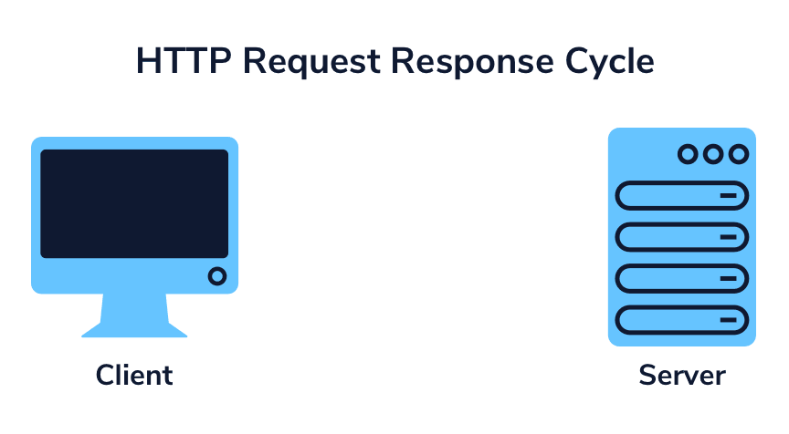
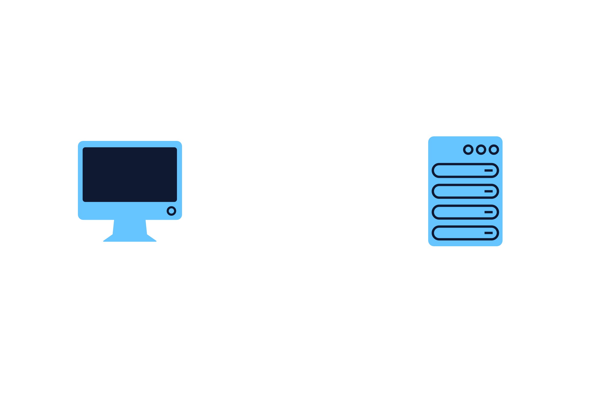

# Persistent Connection

In order for WebSocket connections to achieve bidirectional and continuous communication, there must first exist a persistent connection.

To help us understand this, let’s start by refreshing how non-persistent, uni-directional HTTP connections work. HTTP connections follow a request-response messaging pattern:

In the request-response pattern, a client will open a connection to make a request from a server and the server will send back a response. The connection is then immediately closed requiring a new request to be made to fetch more data.

Unlike HTTP connections, WebSocket connections stay open, or persist, allowing for clients and servers to continuously send information back and forth until either the client or the server decides to terminate the connection. This is also known as a publish-subscribe messaging pattern: the client can “subscribe” to the server and whenever the server “publishes” a message, the subscribers are notified.

This persistent connection provides a few key benefits:

Only one request-response is needed to establish the connection, greatly reducing the data transmitted along with each request in the form of headers.
The WebSocket connection is stateful meaning that state can be maintained on that connection. The server can keep track of the data that has already been sent to the client and vice-versa without relying on cookies or session ids.

Below, we can see that WebSocket connections create a persistent bidirectional communication connection. Once a client and the server have completed a handshake (discussed in detail in the next exercise), a line of communication is opened, meaning that both the client and the server can push data back and forth. Either party may choose to close the connection at any time, however, this does not occur automatically!

Compare and contrast the diagram showing the HTTP request-response pattern with the diagram showing the persistent WebSocket connection.

