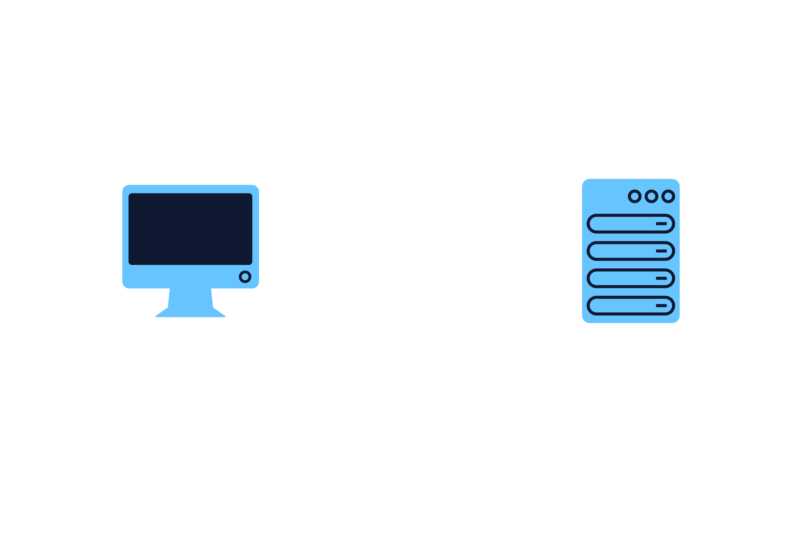

# The Handshake and Upgrade Headers

Where do these persistent WebSocket connections come from? Don’t worry, the answer doesn’t involve storks. WebSockets actually originate from our old friend, HTTP, and something called a `handshake`.

The `handshake` is essentially an agreement between the client and the server to establish a persistent WebSocket connection and is initiated using a plain old HTTP request! In the header of the request, the client must communicate to the server that it wants to upgrade the connection from HTTP to WebSockets. It does so using an HTTP GET request to a ws:// URI along with a set of specific headers like in the following example:

```bash
GET ws://example.com:8080/ HTTP/1.1
Host: localhost:8080
Connection: Upgrade
Upgrade: websocket
Sec-WebSocket-Version: 13
Sec-WebSocket-Key: q4xkcO32u266gldTuKaSOw==
```

The request from the client will include the following required headers:

- The `Connection` header controls whether or not the network connection stays open after the current transaction finishes. A value of `Upgrade` signals that we want to upgrade the connection to a new protocol.
- The `Upgrade` header specifies the protocol that the client wants to switch to. In this case, the protocol `websocket` is specified.
- The `Sec-WebSocket-Key` header is a one-time random value generated by the client and is used by the server to prove that it received a valid WebSocket opening handshake.
- The `Sec-WebSocket-Version: 13` header specifies the WebSocket protocol version the client wishes to use. The most recent (as of 2021) and only accepted version of the WebSocket protocol is 13.

Note: When you visit a website that is built using WebSockets, you will still enter http:// into your browser to make the initial handshake request – the ws:// protocol is used to establish a WebSocket connection after the initial http:// request is made.

Once the server receives this request, it can complete the WebSocket handshake by sending a response to the client like so:

```bash
HTTP/1.1 101 Switching Protocols
Upgrade: websocket
Connection: Upgrade
Sec-WebSocket-Accept: fA9dggdnMPU79lJgAE3W4TRnyDM=
```

Let’s break down each of these response headers:

- The `HTTP/1.1 101 Switching Protocols` header indicates that the server is switching to the protocol that the client requested in its Upgrade request header
- The `Connection: Upgrade` header confirms that the connection has been upgraded.
- The `Upgrade: websocket` header confirms that the protocol is being upgraded from HTTP to WebSocket
- The `Sec-WebSocket-Accept: fA9dggdnMPU79lJgAE3W4TRnyDM=` header is a key generated based on the `Sec-WebSocket-Key`header in the request and is used to authenticate the handshake.

After the client receives the server response, the HTTP connection is replaced by a WebSocket connection and data can begin flowing freely. An application can now benefit from transferring as much data as desired without:

- Incurring the overhead associated with each client-to-server message having an HTTP header.
- Having to open up a new underlying TCP connection for each client-to-server message.


