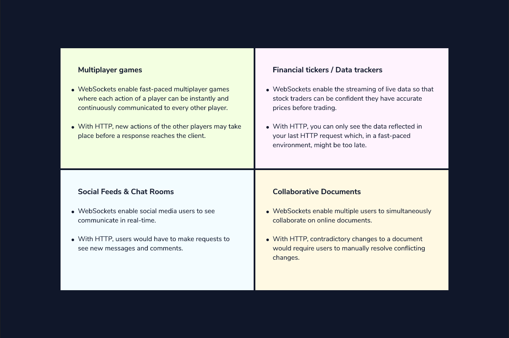
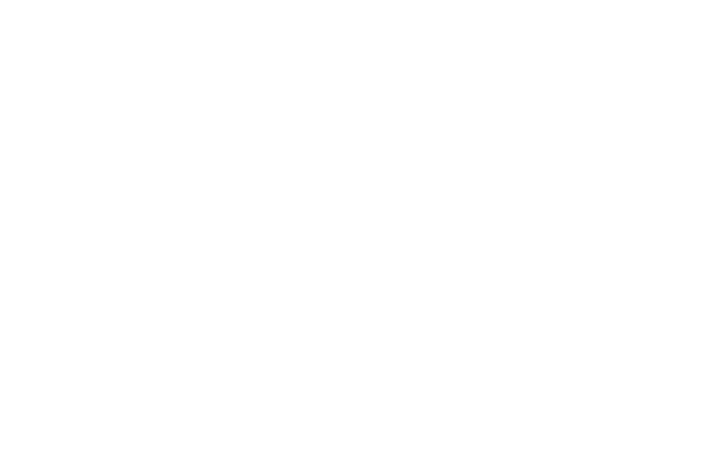

# Apps that Benefit from WebSockets

So far we’ve learned about the communication capabilities of WebSocket connections, the benefits of persistent connections, some details about how an HTTP connection can be upgraded to a WebSocket connection during the handshake process, and about secure WebSocket connections using wss://. As a final step, let’s discuss the applications for which WebSockets can be most beneficial.

WebSockets are the go-to approach for applications that need real-time data. Before WebSockets, many web developers had to rely on abusing the HTTP protocol by repeatedly making HTTP requests in quick succession to simulate continuous streams of data. This resulted in excessive headers, latency buildup, and difficulty tracking each client’s current state.

However, WebSockets aren’t always the superior solution compared to basic HTTP connections so you should consider carefully if WebSockets are needed for your application. To help, you can ask yourself these two questions:

Does the application involve multiple users communicating with each other?
Is the application a window into server-side data that’s constantly changing?
Answering “yes” to either of these questions indicates the need for WebSockets technology.

