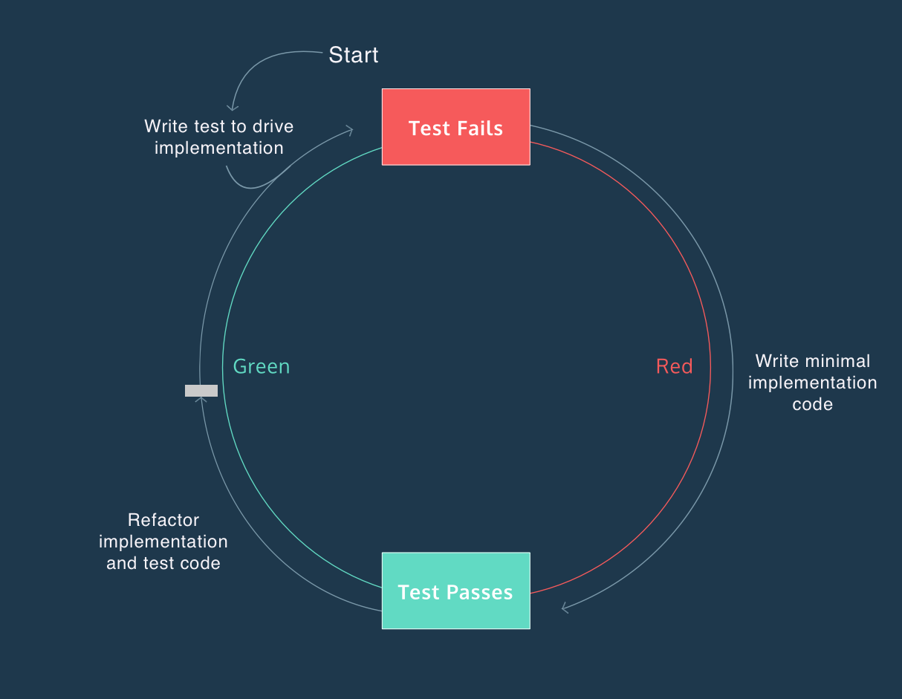

# The Red-Green-Refactor Cycle



- Red — Write tests that describe the intended behavior of implementation code, and then compare developer expectations with the actual results of implementation code. The tests should always fail at first because the implementation code for the desired behavior will be written in response to the failing test.

- Green — Write just enough implementation code to make the test pass. The tests return green because the implementation code executes the intended behavior described by the test in the red phase.

- Refactor — Clean up and optimize code following the characteristics of a good test. Refactoring involves actively considering test and implementation code and making revisions to the code base. The tests are passing and should continue to pass throughout this phase of the cycle.

## Getting Into The Red

When we use the red, green, refactor cycle, we:

- Write test code that fails
- Write implementation code to make the test pass
- Consider refactoring the code

## Red To Green

The red error messages describe the failures of our implementation code, so we can specifically address each issue that is preventing our test from passing.
following TDD, the next step would be writing the minimum possible implementation code to make our test pass.

## Refactor

Once all your tests pass, you can confidently refactor your code — restructure and improve it without changing its external behavior. The confidence comes from knowing that our tests will catch us if we make a misstep.

When refactoring, it’s critical to test early and often — if our tests turn red, then we know that something went wrong while we were refactoring, and we can undo those changes.

A good place to start with refactoring is to restructure tests to reflect the four phases of a good test: setup, exercise, verification, teardown.

## Getting into the Red  - second cycle

Congratulations, you have made it through your first red-green-refactor cycle using TDD! The next step is to repeat this cycle to build a more complete implementation of the .initials method.

Once you have a baseline test for your feature, you can start to write additional test cases that force you to write better implementation code.
The idea of TDD is to continue building tests and going through the red-green-refactor process until you feel confident that your implementation code performs as expected.

## Red to Green II - second cycle

Now that we have tests that cover more than one condition, it is time to program the actual behavior.

## Refactor - second cycle

The next step is to refactor the code so that your tests are fast, complete, reliable, isolated, maintainable, and expressive. Also, you want to make sure your implementation code is descriptive and efficient.

Sometimes refactoring can take place in test and implementation code, either one, or neither. The purpose of the refactor phase is to think critically about the code you have and decide whether there is anything unnecessary, redundant, or that could be done more clearly or efficiently.

## Edge Case

Now that we have written and refactored a few tests, it’s time to consider edge cases.

An edge case is a problem or situation that occurs only at an extreme (maximum or minimum) operating parameter — you can think of these as special cases that you need to account for.

## If not satisfied start again the cycle red green refactor

### Code Coverage Criteria

Measuring code coverage is conducted using one or more criteria, depending on the organization’s standards for code coverage. Though this is not an exhaustive list, some key criteria to use when measuring code coverage include:

Function Coverage: Has each function been called?
Statement Coverage: Has each statement been executed?
Path Coverage: Has every edge in the control-flow graph been executed?
Condition Coverage: Has each boolean sub-expression evaluated to be both true and false?
Let’s look at an example of how these criteria can be used to determine code coverage. Here we have a very simple function that returns the sum of two arguments, if two arguments have been provided, and returns null otherwise:

```js
function numSum(x, y) {
  if (x && y) {
    return (x + y);
  } else {
    return null;
  }
}
```
The most basic test of this function would include calling the function at least once, thus achieving 100% function coverage.

```js
numSum(1, 2);  // This should return 3
```
By executing the function only once and with the arguments above, we will execute some, but not all, of the lines of code in the function. So, we can test our function by calling it with arguments that will return null:

```js
numSum(1, 2);  // This should return 3
numSum(1, false);  // This should return null
```
With these two calls together, both paths in the if / else blocks are taken and both return statements are executed. Thus, we have 100% statement coverage and 100% path coverage.

Finally, to achieve 100% condition coverage, we need to call our function with arguments such that x and y each evaluate to true and false in the function’s if condition statement.

```js
numSum(1, 2);  // This should return 3
numSum(1, false);  // This should return null
numSum(false, 1);  // This should return null
numSum();   // This should return null
```

####The 100% Code Coverage Myth
And there we have it, we’ve achieved 100% coverage in each of the four criteria! So, we’re done testing, right? Well, not quite.

Having 100% code coverage does not guarantee bug-free code – it simply validates the completeness of our tests using a given set of criteria relative to other test suites with lower code coverage. We still must be vigilant about writing robust test suites that specifically address both the intended use cases, and unintended edge cases, of our application.

For example, as written, the numSum function will concatenate numeric string arguments rather than performing addition.

```js
numSum('1', '2') // This will return '12' instead of 3
```

While there are other coverage criteria we can use to identify the full range of function parameters, code coverage is an insufficient metric to determine if our tests confirm the intended functionality of our program as defined by the end user’s requirements.

Instead, we should consider the code coverage criteria as a set of guidelines to help you develop intuition for testing your code while remaining determined to write robust test suites that are specific in targeting the various use cases of our programs.

#### Test Coverage

Another term you may hear with regards to testing is called test coverage. Test coverage differs from code coverage in that test coverage measures the percentage of the required features/specs that are tested, as opposed to the percentage of lines executed. These features/specs are typically defined in a requirements document provided by a client or product designer.

Suppose you are building a mobile-native application that needs to work on phones using the Android and iOS operating systems but is not expected to work on desktop browsers. Accordingly, to achieve high test coverage, you will be expected to write tests for your application’s performance on Android and iOS but not on browsers.

Like code coverage, test coverage cannot guarantee that our program will not have unexpected behavior. However, the pursuit of high test coverage can lead us to identify bugs and unexpected behavior earlier on in the development process.
